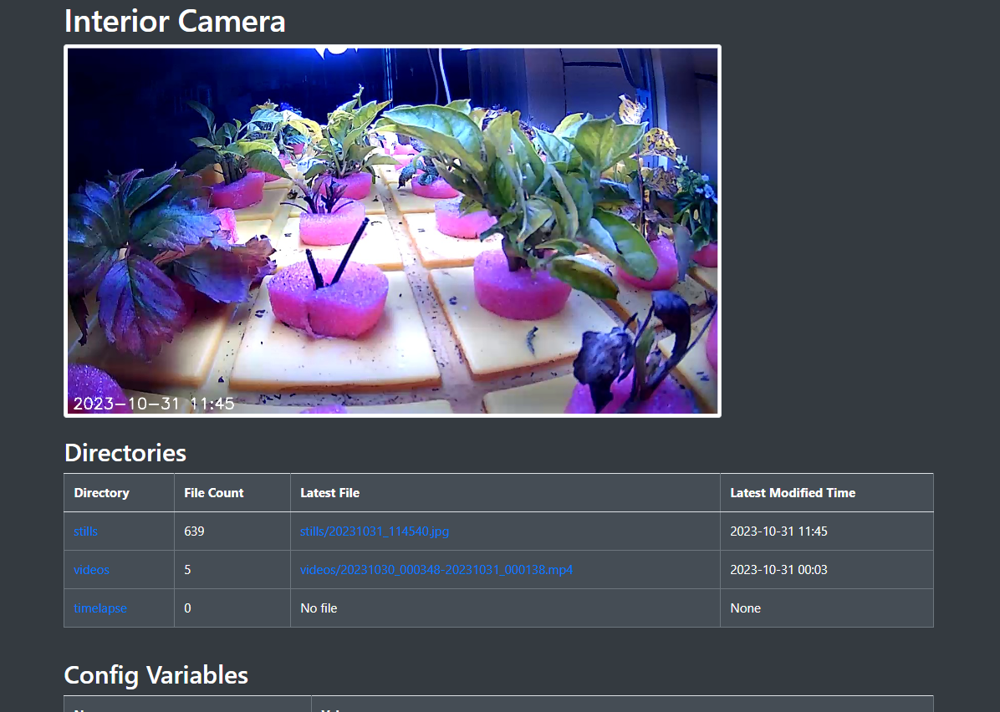

# RTSP-Timelapse

RTSP-Timelapse is a Docker-based project that captures images from an RTSP stream at regular intervals and compiles them into a timelapse video. It also includes a mobile-ready web interface to display the latest image and status.

## Features

- Captures still images from an RTSP stream at regular intervals.
- Compiles the captured images into a timelapse video.
- Provides a mobile-ready web interface for real-time updates.
- Allows standalone execution of various Python scripts.

## Configuration

The behavior of the timelapse creation is controlled by environment variables. These can be set in a `.env` file for development or directly in the `docker-compose.yaml` file for deployment.

Refer to `config.py` for a description of each environment variable.

## Development

1. Create a `.env` file in the root directory.
2. Set the necessary environment variables as described in `config.py`.
3. The Python script `main.py` uses these variables to control the behavior of the timelapse creation.
4. Various Python scripts can be run standalone for testing or specific tasks.

## Deployment

1. Set the environment variables directly in the `docker-compose.yaml` file.
2. Use Docker Compose to build and run the application.